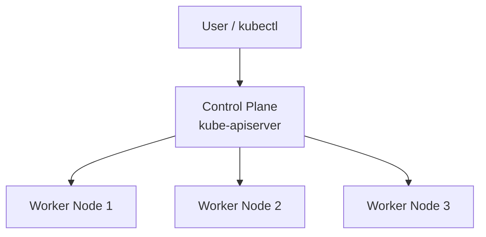
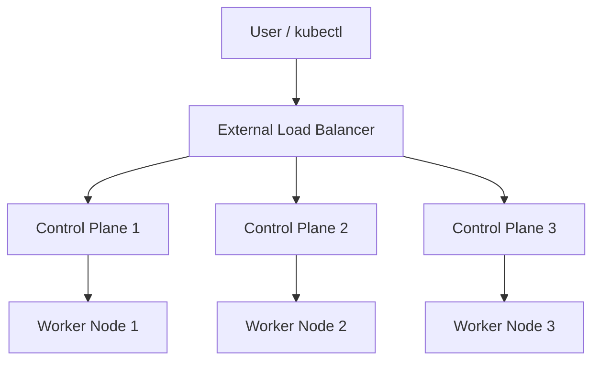
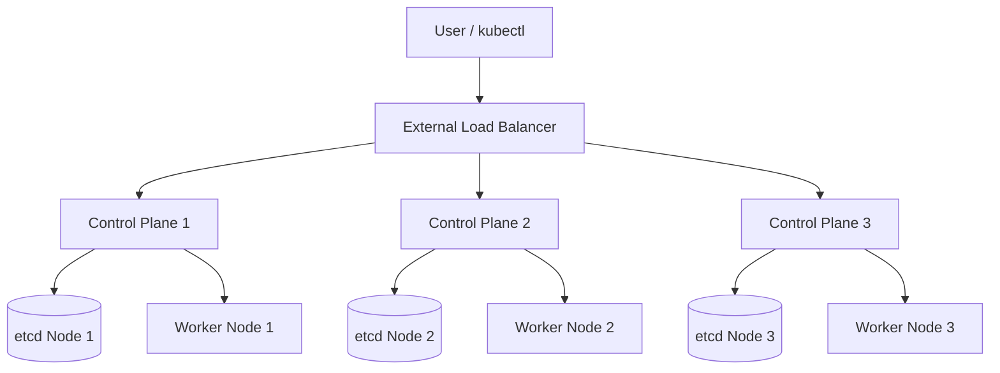
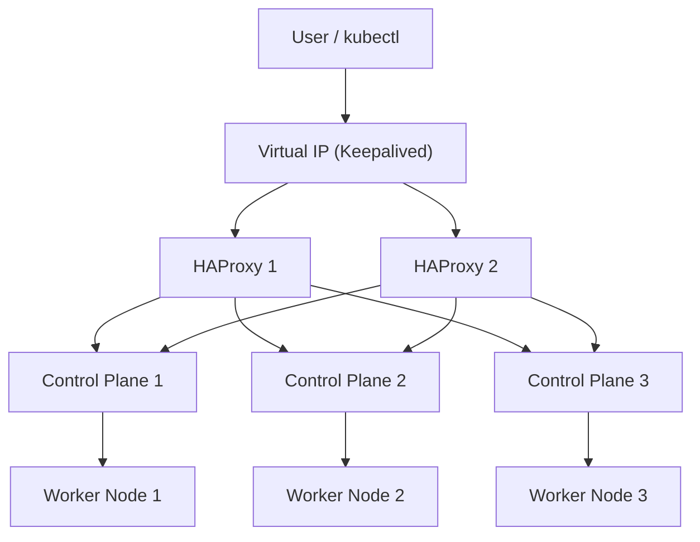

## 1.1. Infrastructure Preparation

Before installing Kubernetes, every node must meet requirements regarding hardware, operating system, kernel, network, and runtime. This section explains these prerequisites systematically.

### 1.1.1. Minimum Node Requirements

Here are the minimum recommendations for Kubernetes nodes:

**Control Plane Node**
- CPU: 2–4 vCPU
- RAM: 4–8 GB
- Storage: SSD
- NIC: minimum 1 Gbps

**Worker Node**
- CPU: 2 vCPU or more
- RAM: minimum 2 GB
- Storage: SSD
- NIC: minimum 1 Gbps

For production environments, it is recommended to have at least **3 control plane nodes** for high availability.

### 1.1.2. Compatible Operating Systems

Commonly used OS:

- Ubuntu LTS
- Debian
- Rocky Linux 8/9

General recommendations:

- Use minimal OS without GUI.
- Modern kernel (version 5.x or newer).
- Remove unnecessary packages to reduce attack surface.


### 1.1.3. Required Kernel Modules

The kernel must load the following modules:

```
overlay
br_netfilter
```

Activate modules:

```bash
sudo modprobe overlay
sudo modprobe br_netfilter
```

To make it persistent after reboot:

```bash
cat <<EOF | sudo tee /etc/modules-load.d/k8s.conf
overlay
br_netfilter
EOF
```

### 1.1.4. Cgroups and Control Group Drivers

Kubernetes uses **cgroups** to limit, organize, and monitor resources. Two common types of cgroup drivers:

* **systemd** (recommended by Kubernetes)
* **cgroupfs**

Container runtime and kubelet **must use the same driver** to avoid conflicts.

### 1.1.5. Network Prerequisites

Kubernetes requires the following network configuration:

* IP forwarding active
* Bridge traffic visible to iptables
* Nodes connected to each other (full mesh)
* MTU minimum 1500 (or adjust CNI)

Mandatory Sysctl:

```bash
cat <<EOF | sudo tee /etc/sysctl.d/k8s.conf
net.bridge.bridge-nf-call-iptables=1
net.bridge.bridge-nf-call-ip6tables=1
net.ipv4.ip_forward=1
EOF

sudo sysctl --system
```

### 1.1.6. Firewall, Ports, and IP Forwarding

#### Ports for Control Plane

| Port      | Protocol | Description                |
| --------- | -------- | -------------------------- |
| 6443      | TCP      | Kubernetes API server      |
| 2379–2380 | TCP      | etcd server and client API |
| 10250     | TCP      | Kubelet API                |
| 10257     | TCP      | kube-controller-manager    |
| 10259     | TCP      | kube-scheduler             |

#### Ports for Worker Node

| Port        | Protocol | Description       |
| ----------- | -------- | ----------------- |
| 10250       | TCP      | Kubelet API       |
| 30000–32767 | TCP      | NodePort Services |

#### Mandatory Non-technical:

* Disable swap
* NTP/time sync active (e.g., chrony)

Disable swap:

```bash
sudo swapoff -a
sudo sed -i '/swap/d' /etc/fstab
```


### 1.1.7. Node Quantity Planning and Network Topology

Cluster topology types:

**Single control plane** suitable for development or testing



**Multi control plane** First option for production



**External etcd cluster** Another more advanced option for production



**External load balancer** Option for production with very strict SLA



---

## 1.2. Container Runtime Installation

Kubernetes uses Container Runtime Interface (CRI) to run containers. Two recommended runtimes are:

* containerd
* CRI-O

Kubernetes uses Container Runtime Interface (CRI) to run containers, and two recommended runtimes are **containerd** and **CRI-O**. Both runtimes are recommended because they officially support CRI without requiring additional layers (like the removed dockershim), have high stability, are widely used in the industry, and are maintained by large communities and organizations like CNCF, Red Hat, and Docker/Moby.

The difference lies in their focus and ecosystem. **containerd** is a general-purpose runtime used widely across various container platforms, not just Kubernetes. It supports many additional features like image management, snapshotter plugins, and has a large ecosystem as it was originally a core part of Docker. Meanwhile, **CRI-O** is a runtime built specifically for Kubernetes and focuses on simplicity, security, and strict compliance with CRI. CRI-O does not provide features outside of Kubernetes needs, making it more minimalist compared to containerd. Thus, containerd excels in flexibility and ecosystem compatibility, while CRI-O excels in simplicity and stability based on pure Kubernetes needs.


### 1.2.1. containerd Installation

Install containerd:

```bash
sudo apt-get update && sudo apt-get install -y containerd
sudo mkdir -p /etc/containerd
containerd config default | sudo tee /etc/containerd/config.toml
```

Set cgroup driver to systemd:

Edit file `/etc/containerd/config.toml`:

```
[plugins."io.containerd.grpc.v1.cri".containerd.runtimes.runc.options]
  SystemdCgroup = true
```

Restart containerd:

```bash
sudo systemctl restart containerd
sudo systemctl enable containerd
```

### 1.2.2. CRI-O Installation

CRI-O is a minimalist runtime for Kubernetes.

Example installation (Ubuntu 22.04):

```bash
OS=xUbuntu_22.04
VERSION=1.30

echo "deb https://download.opensuse.org/repositories/devel:/kubic:/libcontainers:/stable/$OS/ /" \
  | sudo tee /etc/apt/sources.list.d/libcontainers.list

echo "deb https://download.opensuse.org/repositories/devel:/kubic:/cri-o:/$VERSION/$OS/ /" \
  | sudo tee /etc/apt/sources.list.d/cri-o.list

sudo apt-get update
sudo apt-get install -y cri-o cri-o-runc
sudo systemctl enable --now crio
```

### 1.2.3. Comparison of containerd and CRI-O

| Aspect        | containerd              | CRI-O               |
| ------------- | ----------------------- | ------------------- |
| Focus         | General-purpose runtime | Kubernetes-specific |
| Stability     | Very stable             | Very stable         |
| Ecosystem     | Extensive               | Simpler             |
| Integration   | Many tools available    | Optimal for CRI     |
| Default for   | Many K8s distros        | OpenShift           |

### 1.2.4. Sandbox Image Configuration

A sandbox image is a special image (usually `pause` container) used by Kubernetes to create "Pod infrastructure". Pod infrastructure is the base environment providing shared namespaces like network, IPC (Inter-Process Communication), and PID for all containers in a Pod. This sandbox container runs as the main process (PID 1) inside the Pod and functions to keep the network namespace alive, ensuring all application containers share the same IP, and serving as the foundation of the Pod lifecycle. If the sandbox container stops, the entire Pod will be terminated. In other words, the sandbox image forms the Pod skeleton so application containers can run inside it.


Example containerd configuration:

```
[plugins."io.containerd.grpc.v1.cri"]
  sandbox_image = "registry.k8s.io/pause:3.9"
```

### 1.2.5. Runtime Optimization

Optimization recommendations:

* Use SSD for image and layer storage.
* Use systemd driver on containerd/CRI-O.
* Use local registry mirror to speed up image pulling.
* Ensure kernel limits (ulimit) are large enough.
* Ensure network MTU matches environment (CNI is sensitive to MTU).

---

# End of Module 1

This module explains the technical components that must be prepared before installing Kubernetes. Properly configured infrastructure is the foundation of cluster stability.
