## 3.1. Container Network Interface (CNI)

CNI is the standard for managing Pod networks within Kubernetes. Kubernetes does not provide network implementation itself, but relies on CNI plugins to manage IP addresses, routing, policies, and connectivity between Pods.

### 3.1.1. CNI Architecture

CNI architecture consists of several components:

- **CNI plugin**: executes network interface attach/detach operations.
- **CNI configuration**: default configuration file is at `/etc/cni/net.d/`.
- **Container runtime (CRI)**: calls CNI plugin when a Pod is created.
- **Kubelet**: manages Pod networking lifecycle.
- **Network interface (veth pairs)**: connects Pod to node network.

The process:

```mermaid
flowchart LR

    %% ===== ROW 1 =====
    A[1. Pod created<br/>API Server] --> B[2. kubelet:<br/>RunPodSandbox request] --> C[3. Container Runtime<br/>containerd / CRI-O]

    %% ===== ROW 2 =====
    D[4. CNI Plugin<br/>ADD execution] --> E[5. CNI configures<br/>veth / IP / routes] --> F[6. CNI returns IP<br/>to runtime → Pod Ready]

    %% ===== FLOW CONNECTION BETWEEN ROWS =====
    C --> D

```



### 3.1.2. Comparison of Calico, Cilium, Flannel, and Weave

| CNI | Pros | Cons | Use Case |
|-----|-----------|------------|-----------|
| **Calico** | Very strong network policy, no overlay, supports BGP | More complex | Enterprise, large clusters |
| **Cilium** | eBPF-based, high performance, good observability | Needs modern kernel | High security & performance |
| **Flannel** | Simplest, easy to install | Limited network policy | Small/medium clusters |
| **Weave** | Automatic mesh, easy setup | Performance below Cilium/Calico | Small multi-node, Dev/Test |

### 3.1.3. When to Choose a Specific CNI Plugin

- **Use Calico** if you need strong network policies and high routing performance (e.g., large production).
- **Use Cilium** if you want eBPF technology, deep observability, and high performance.
- **Use Flannel** for simple clusters or minimal needs.
- **Use Weave Net** for developer clusters with many small nodes.

---

## 3.2. Container Storage Interface (CSI)

CSI is the standard for storage provisioning in Kubernetes. With CSI, storage vendors can provide their own plugins without having to modify core Kubernetes.

### 3.2.1. CSI Concepts

Main CSI components:

- **CSI driver**: plugin from storage vendor.
- **External provisioner**: creates volumes automatically.
- **External attacher**: connects volumes to nodes.
- **External resizer**: expands volume capacity.
- **External snapshotter**: creates/restores snapshots.

### 3.2.2. Provisioner vs Attacher

**Provisioner**

- Creates PV dynamically when PVC is created.
- Works with StorageClass.
- Example: creating a new disk in cloud provider.

**Attacher**

- Connects volume to the node where the Pod is running.
- Manages volume *mounting* and lifecycle.
- Example: attaching EBS to worker node in AWS.

### 3.2.3. Popular CSI in Cloud and On-Prem

**Cloud Provider**

- AWS EBS CSI
- GCP PD CSI
- Azure Disk/File CSI

**On-Prem**

- Ceph RBD / CephFS
- Longhorn
- NFS CSI
- OpenEBS
- VMware vSphere CSI

---

## 3.3. Container Runtime Interface (CRI)

CRI is the standard API used by Kubernetes to interact with container runtimes like containerd and CRI-O.

### 3.3.1. CRI API

CRI consists of two main parts:

- **RuntimeService**: runs and manages container sandboxes.
- **ImageService**: pulls, stores, and deletes container images.

Example operations performed by CRI:

- `RunPodSandbox`
- `CreateContainer`
- `StartContainer`
- `PullImage`

### 3.3.2. Containerd vs CRI-O (Brief)

**containerd**

- General-purpose runtime.
- Also used by Docker.
- Large ecosystem, flexible.
- Widely used by Kubernetes distros.

**CRI-O**

- Built specifically for Kubernetes.
- Minimalist and focused on CRI only.
- Lighter than containerd.
- Used on Red Hat OpenShift.

Core difference: containerd is more flexible and broad, CRI-O is more minimalist and Kubernetes-native.

---

## 3.4. Custom Resource Definitions (CRD)

CRDs are used to extend the Kubernetes API so users can create new resources outside of standard resources like Pods and Deployments.

### 3.4.1. What Is a CRD?

A CRD is a custom resource definition added to the Kubernetes API to create new objects like:

- `MySQLCluster`
- `KafkaTopic`
- `RedisFailover`

Once a CRD is created, the resource can be used like built-in Kubernetes resources.

### 3.4.2. How Controllers Work

Every CRD is usually followed by a **controller** that:

- Observes changes to CRD objects.
- Compares desired state and actual state.
- Executes actions to reconcile the state (reconciliation).

This is the core of Kubernetes architecture.

### 3.4.3. Event Reconciliation

Reconciliation runs in a loop:

1. User creates or modifies a CRD resource.
2. Controller detects event via API server.
3. Controller calculates difference between desired vs actual state.
4. Controller takes action to fix the discrepancy.
5. State becomes consistent again.

### 3.4.4. Simple CRD Example

Example CRD named `AppConfig`:

```yaml
apiVersion: apiextensions.k8s.io/v1
kind: CustomResourceDefinition
metadata:
  name: appconfigs.example.com
spec:
  group: example.com
  names:
    kind: AppConfig
    plural: appconfigs
    singular: appconfig
  scope: Namespaced
  versions:
    - name: v1
      served: true
      storage: true
      schema:
        openAPIV3Schema:
          type: object
          properties:
            replicas:
              type: integer
            message:
              type: string
```

---

## 3.5. Operators

Operators are a pattern for automating complex application management in Kubernetes using CRDs + controllers.

### 3.5.1. Operator Pattern

Operators usually include capabilities:

* Automatic deployment and scaling.
* Backup and restore.
* Failure recovery.
* Application upgrades.
* Dynamic runtime configuration.

In essence: an operator is an "SRE in software form".

### 3.5.2. Operator Installation

Operators are usually installed via Helm, YAML, or OperatorHub:

```bash
kubectl apply -f https://operatorhub.io/install/mysql-operator.yaml
```

### 3.5.3. Popular Operator Examples

* **Prometheus Operator** : automation of Prometheus, Alertmanager, and Grafana.
* **Cert-Manager** : automatic TLS certificate management.
* **Elastic Operator** : manage Elasticsearch cluster.
* **ArgoCD Operator** : GitOps controller.

---

# End of Module 3

This module discusses key extension components in Kubernetes that enable networking, storage, container runtime, as well as the ability to extend the Kubernetes API through Custom Resource Definitions (CRDs) and Operators.
