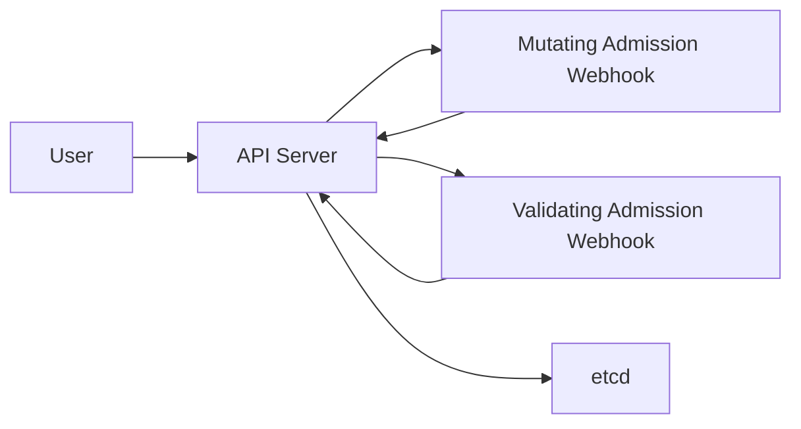

## 7.1. Node Affinity and Anti-Affinity

Node affinity manages preferences or requirements for Pods to be scheduled on specific nodes based on labels. This mechanism works as a filter and priority in the scheduler.

### 7.1.1. RequiredDuringSchedulingIgnoredDuringExecution

* Mandatory to be met during scheduling
* If no matching node is found, Pod remains in Pending status
* Not re-evaluated when Pod is already running

Example:

```yaml
affinity:
  nodeAffinity:
    requiredDuringSchedulingIgnoredDuringExecution:
      nodeSelectorTerms:
      - matchExpressions:
        - key: zone
          operator: In
          values:
          - east
```

### 7.1.2. PreferredDuringSchedulingIgnoredDuringExecution

* Only a preference, not mandatory
* Scheduler chooses the best node based on weight
* Pod is still run on another node if necessary

Example:

```yaml
affinity:
  nodeAffinity:
    preferredDuringSchedulingIgnoredDuringExecution:
    - weight: 100
      preference:
        matchExpressions:
        - key: performance
          operator: In
          values:
          - high
```

---
## 7.2. Pod Affinity and Anti-Affinity

Pod affinity is a scheduling rule that considers the location of other Pods. Used to:

* Group Pods to be close (affinity)
* Separate Pods to be spread out (anti-affinity)

### 7.2.1. Pod Affinity

Places Pods in the same node or zone as other Pods.

```yaml
affinity:
  podAffinity:
    requiredDuringSchedulingIgnoredDuringExecution:
    - labelSelector:
        matchLabels:
          app: backend
      topologyKey: kubernetes.io/hostname
```

### 7.2.2. Pod Anti-Affinity

Prevents Pods from being close to each other. Suitable for high availability.

```yaml
affinity:
  podAntiAffinity:
    preferredDuringSchedulingIgnoredDuringExecution:
    - weight: 50
      podAffinityTerm:
        labelSelector:
          matchLabels:
            app: api
        topologyKey: topology.kubernetes.io/zone
```

---

## 7.3. Taints and Tolerations

Taints and tolerations allow nodes to reject specific Pods unless the Pod has a matching toleration.

### 7.3.1. Taints

Taint is applied to a node:

```bash
kubectl taint nodes node1 key=value:NoSchedule
```

Meaning:

* Node only accepts Pods that have matching toleration

Taint effect types:

| Effect           | Meaning                                       |
| ---------------- | --------------------------------------------- |
| NoSchedule       | Do not schedule new Pods                      |
| PreferNoSchedule | Try not to schedule, but still allowed        |
| NoExecute        | Pods without toleration will be evicted       |

### 7.3.2. Tolerations

Toleration is added to the Pod:

```yaml
tolerations:
- key: "key"
  operator: "Equal"
  value: "value"
  effect: "NoSchedule"
```

### 7.3.3. Case Example

GPU Node should only be used by ML Pods:

```bash
kubectl taint nodes gpu-node accelerator=nvidia:NoSchedule
```

ML Pod:

```yaml
tolerations:
- key: "accelerator"
  operator: "Equal"
  value: "nvidia"
  effect: "NoSchedule"
```

---

## 7.4. Resource Quotas and LimitRange

Kubernetes provides resource limitation mechanisms at the namespace level for fairness and preventing excessive consumption.

### 7.4.1. ResourceQuota

ResourceQuota limits total resources in a namespace.

```yaml
apiVersion: v1
kind: ResourceQuota
metadata:
  name: team-a-quota
spec:
  hard:
    requests.cpu: "4"
    requests.memory: 8Gi
    limits.cpu: "8"
    limits.memory: 16Gi
    pods: "20"
```

Can limit:

* number of Pods
* total CPU and memory
* number of PVCs
* number of Services and LoadBalancers

### 7.4.2. LimitRange

LimitRange provides default request, default limit, and min or max limits per container.

```yaml
apiVersion: v1
kind: LimitRange
metadata:
  name: default-limits
spec:
  limits:
  - type: Container
    default:
      cpu: "500m"
      memory: "512Mi"
    defaultRequest:
      cpu: "200m"
      memory: "256Mi"
    max:
      cpu: "2"
      memory: "2Gi"
    min:
      cpu: "100m"
      memory: "128Mi"
```

### Interaction of ResourceQuota and LimitRange

* ResourceQuota manages maximum total resources in a namespace
* LimitRange manages limits and defaults for each Pod or container

---

## 7.5. Pod Security Standards (PSS)

PSS is the modern Pod security standard replacing PodSecurityPolicy. PSS has three security levels:

| Level      | Description                                                     |
| ---------- | --------------------------------------------------------------- |
| Privileged | Allows full access, used for system Pods                        |
| Baseline   | Default secure settings, prevents privilege escalation          |
| Restricted | Highest security level, requires non-root and strict limits     |

### 7.5.1. Privileged

* Most free access
* Allows privileged containers and host namespaces

### 7.5.2. Baseline

* Suitable for general applications
* Rejects risky features like privileged and hostPID

### 7.5.3. Restricted

* Only allows non-root containers
* Requires seccomp profile and readOnlyRootFilesystem

### 7.5.4. Example PSS on Namespace

```yaml
apiVersion: v1
kind: Namespace
metadata:
  name: secure-ns
  labels:
    pod-security.kubernetes.io/enforce: restricted
```

---

## 7.6. Admission Controller

Admission Controller is a component that validates and modifies requests before objects are stored in etcd. It sits after authentication and authorization.

### 7.6.1. Two Types of Admission Controllers

**Mutating Admission Controller**

  * Modifies object before saving
  * Example: injecting sidecar (Istio), setting default values

**Validating Admission Controller**

  * Validates without modifying
  * Example: ResourceQuota, PodSecurity, built-in validation

### 7.6.2. Important Admission Controller Examples

| Admission Controller           | Function                           |
| ------------------------------ | ---------------------------------- |
| PodSecurity                    | Applies PSS                        |
| LimitRanger                    | Provides default resources         |
| ResourceQuota                  | Limits total namespace resources   |
| MutatingWebhookConfiguration   | Custom mutation                    |
| ValidatingWebhookConfiguration | Custom validation                  |

### 7.6.3. Admission Workflow

General flow:



1. User sends request to API Server
2. API Server performs:

   * authentication
   * authorization
   * admission controller

3. If valid from API Server side, object is stored in etcd

---

# End of Module 7

This module explains Pod scheduling mechanisms using affinity, anti-affinity, taints, and tolerations. Additionally, the module discusses resource limitation with ResourceQuota and LimitRange, Pod Security Standards, and Admission Controller as a request validation and mutation layer.
