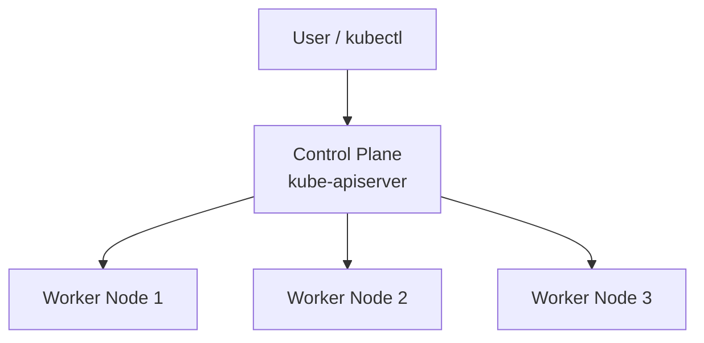
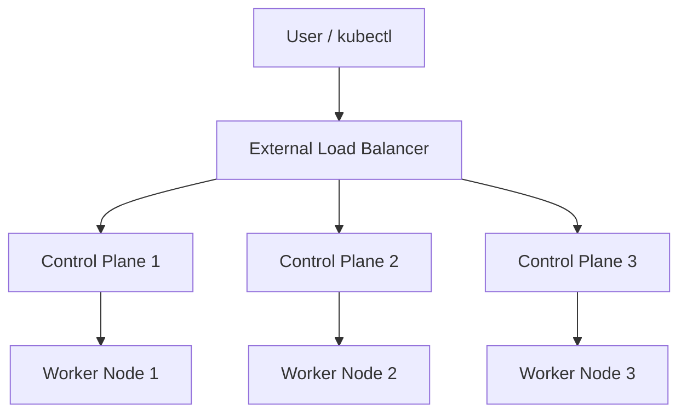
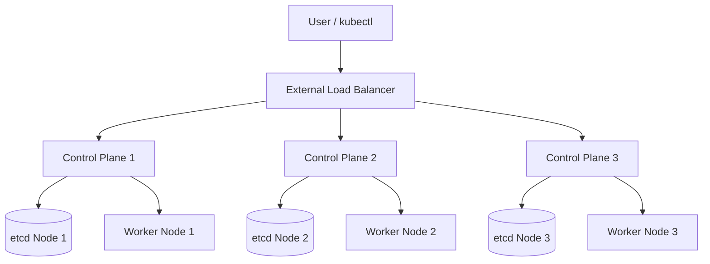
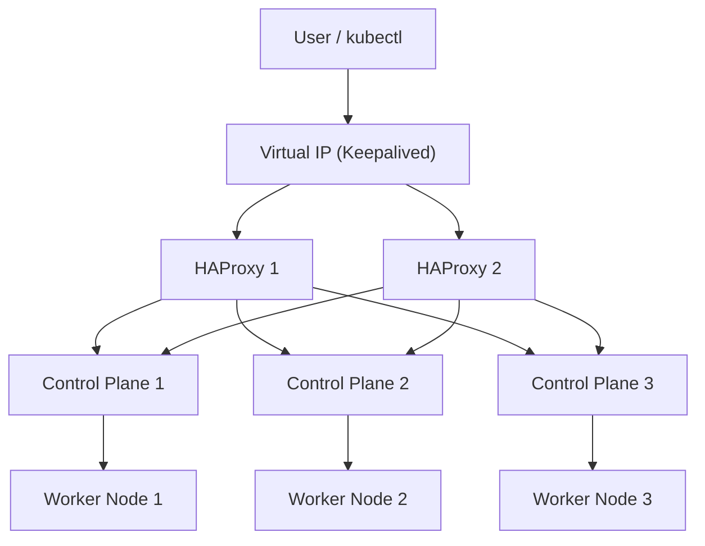

## 1.1. Persiapan Infrastruktur

Sebelum menginstal Kubernetes, setiap node harus memenuhi persyaratan terkait hardware, sistem operasi, kernel, jaringan, dan runtime. Bagian ini menjelaskan prasyarat tersebut secara sistematis.

### 1.1.1. Syarat Minimum Node

Berikut rekomendasi minimum untuk node Kubernetes:

**Control Plane Node**
- CPU: 2–4 vCPU  
- RAM: 4–8 GB  
- Storage: SSD  
- NIC: minimal 1 Gbps  

**Worker Node**
- CPU: 2 vCPU atau lebih  
- RAM: minimal 2 GB  
- Storage: SSD  
- NIC: minimal 1 Gbps  

Untuk lingkungan produksi, disarankan memiliki minimal **3 control plane node** untuk high availability.

### 1.1.2. Sistem Operasi yang Kompatibel

OS yang umum digunakan:

- Ubuntu LTS  
- Debian  
- Rocky Linux 8/9   

Rekomendasi umum:

- Gunakan OS minimal tanpa GUI.  
- Kernel modern (versi 5.x atau lebih baru).  
- Hapus paket tidak perlu untuk mengurangi attack surface.


### 1.1.3. Kernel Modules yang Diperlukan

Kernel harus memuat modul berikut:

```
overlay
br_netfilter
```

Aktifkan modul:

```bash
sudo modprobe overlay
sudo modprobe br_netfilter
```

Agar persistent setelah reboot:

```bash
cat <<EOF | sudo tee /etc/modules-load.d/k8s.conf
overlay
br_netfilter
EOF
```

### 1.1.4. Cgroups dan Control Group Drivers

Kubernetes menggunakan **cgroups** untuk membatasi, mengatur, dan memonitor resource. Dua jenis cgroup driver yang umum:

* **systemd** (direkomendasikan oleh Kubernetes)
* **cgroupfs**

Container runtime dan kubelet **harus menggunakan driver yang sama** untuk menghindari konflik.

### 1.1.5. Network Prerequisites

Kubernetes membutuhkan konfigurasi jaringan berikut:

* IP forwarding aktif
* Bridge traffic terlihat oleh iptables
* Node saling terhubung (full mesh)
* MTU minimal 1500 (atau sesuaikan CNI)

Sysctl wajib:

```bash
cat <<EOF | sudo tee /etc/sysctl.d/k8s.conf
net.bridge.bridge-nf-call-iptables=1
net.bridge.bridge-nf-call-ip6tables=1
net.ipv4.ip_forward=1
EOF

sudo sysctl --system
```

### 1.1.6. Firewall, Port, dan IP Forwarding

#### Port untuk Control Plane

| Port      | Protocol | Deskripsi                  |
| --------- | -------- | -------------------------- |
| 6443      | TCP      | Kubernetes API server      |
| 2379–2380 | TCP      | etcd server dan client API |
| 10250     | TCP      | Kubelet API                |
| 10257     | TCP      | kube-controller-manager    |
| 10259     | TCP      | kube-scheduler             |

#### Port untuk Worker Node

| Port        | Protocol | Deskripsi         |
| ----------- | -------- | ----------------- |
| 10250       | TCP      | Kubelet API       |
| 30000–32767 | TCP      | NodePort Services |

#### Non-teknis yang wajib:

* Disable swap
* NTP/time sync aktif (misalnya chrony)

Disable swap:

```bash
sudo swapoff -a
sudo sed -i '/swap/d' /etc/fstab
```


### 1.1.7. Perencanaan Jumlah Node dan Topologi Jaringan

Jenis topologi cluster:

**Single control plane** cocok untuk development atau testing



**Multi control plane** Opsi pertama untuk production



**External etcd cluster** Opsi lain yang lebih advance untuk production



**Load balancer external** Opsi untuk production dengan SLA yang sangat ketat



---

## 1.2. Instalasi Container Runtime

Kubernetes menggunakan Container Runtime Interface (CRI) untuk menjalankan container. Dua runtime yang direkomendasikan adalah:

* containerd
* CRI-O

Kubernetes menggunakan Container Runtime Interface (CRI) untuk menjalankan container, dan dua runtime yang direkomendasikan adalah **containerd** dan **CRI-O**. Kedua runtime ini direkomendasikan karena keduanya secara resmi mendukung CRI tanpa memerlukan lapisan tambahan (seperti dockershim yang sudah dihapus), memiliki stabilitas tinggi, digunakan secara luas di industri, serta dipelihara oleh komunitas besar dan organisasi besar seperti CNCF, Red Hat, dan Docker/Moby.

Perbedaannya terletak pada fokus dan ekosistemnya. **containerd** merupakan runtime general-purpose yang digunakan secara luas di berbagai platform container, tidak hanya Kubernetes. Ia mendukung banyak fitur tambahan seperti image management, snapshotter plugins, dan memiliki ekosistem besar karena awalnya merupakan bagian inti dari Docker. Sementara itu, **CRI-O** adalah runtime yang dibuat khusus untuk Kubernetes dan berfokus pada kesederhanaan, keamanan, dan kepatuhan ketat terhadap CRI. CRI-O tidak menyediakan fitur di luar kebutuhan Kubernetes, sehingga lebih minimalis dibandingkan containerd. Dengan demikian, containerd unggul dalam fleksibilitas dan kompatibilitas ekosistem, sedangkan CRI-O unggul dalam kesederhanaan dan stabilitas yang berbasis pada kebutuhan murni Kubernetes.


### 1.2.1. Instalasi containerd

Instal containerd:

```bash
sudo apt-get update && sudo apt-get install -y containerd
sudo mkdir -p /etc/containerd
containerd config default | sudo tee /etc/containerd/config.toml
```

Set cgroup driver ke systemd:

Edit file `/etc/containerd/config.toml`:

```
[plugins."io.containerd.grpc.v1.cri".containerd.runtimes.runc.options]
  SystemdCgroup = true
```

Restart containerd:

```bash
sudo systemctl restart containerd
sudo systemctl enable containerd
```

### 1.2.2. Instalasi CRI-O

CRI-O merupakan runtime minimalis untuk Kubernetes.

Instalasi contoh (Ubuntu 22.04):

```bash
OS=xUbuntu_22.04
VERSION=1.30

echo "deb https://download.opensuse.org/repositories/devel:/kubic:/libcontainers:/stable/$OS/ /" \
  | sudo tee /etc/apt/sources.list.d/libcontainers.list

echo "deb https://download.opensuse.org/repositories/devel:/kubic:/cri-o:/$VERSION/$OS/ /" \
  | sudo tee /etc/apt/sources.list.d/cri-o.list

sudo apt-get update
sudo apt-get install -y cri-o cri-o-runc
sudo systemctl enable --now crio
```

### 1.2.3. Perbandingan containerd dan CRI-O

| Aspek         | containerd              | CRI-O               |
| ------------- | ----------------------- | ------------------- |
| Fokus         | General-purpose runtime | Kubernetes-specific |
| Stabilitas    | Sangat stabil           | Sangat stabil       |
| Ekosistem     | Luas                    | Lebih sederhana     |
| Integrasi     | Banyak tools tersedia   | Optimal untuk CRI   |
| Default untuk | Banyak distro K8s       | OpenShift           |

### 1.2.4. Konfigurasi Sandbox Image

Sandbox image adalah image khusus (biasanya `pause` container) yang digunakan Kubernetes untuk membuat “infrastruktur Pod”. Infrastruktur Pod adalah lingkungan dasar yang menyediakan namespace bersama seperti network, IPC (Inter-Process Communication), dan PID untuk semua container dalam Pod. Sandbox container ini berjalan sebagai proses utama (PID 1) di dalam Pod dan berfungsi menjaga network namespace tetap hidup, memastikan semua container aplikasi berbagi IP yang sama, serta menjadi fondasi lifecycle Pod. Jika sandbox container berhenti, seluruh Pod akan dihentikan. Dengan kata lain, sandbox image membentuk kerangka Pod sehingga container aplikasi dapat berjalan di dalamnya.


Contoh konfigurasi containerd:

```
[plugins."io.containerd.grpc.v1.cri"]
  sandbox_image = "registry.k8s.io/pause:3.9"
```

### 1.2.5. Optimasi Runtime

Rekomendasi optimasi:

* Gunakan SSD untuk penyimpanan image dan layer.
* Gunakan driver systemd pada containerd/CRI-O.
* Gunakan registry mirror lokal untuk mempercepat pulling image.
* Pastikan limit kernel (ulimit) cukup besar.
* Pastikan network MTU sesuai lingkungan (CNI sensitif terhadap MTU).

---

# Akhir dari Modul 1. 

Modul ini menjelaskan komponen-komponen teknis yang harus disiapkan sebelum instalasi Kubernetes. Infrastruktur yang terkonfigurasi dengan benar merupakan fondasi stabilitas cluster.