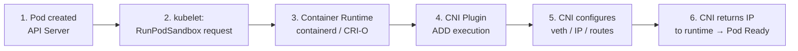

## 3.1. Container Network Interface (CNI)

CNI adalah standar untuk mengatur jaringan Pod dalam Kubernetes. Kubernetes tidak menyediakan sendiri implementasi jaringan, tetapi mengandalkan plugin CNI untuk mengatur IP address, routing, policy, dan konektivitas antar Pod.

### 3.1.1. Arsitektur CNI

Arsitektur CNI terdiri dari beberapa komponen:

- **CNI plugin**: menjalankan operasi attach/detach network interface.
- **CNI configuration**: file konfigurasi default ada di `/etc/cni/net.d/`.
- **Container runtime (CRI)**: memanggil plugin CNI saat Pod dibuat.
- **Kubelet**: mengatur lifecycle networking Pod.
- **Network interface (veth pairs)**: menghubungkan Pod ke jaringan node.

Prosesnya:



### 3.1.2. Perbandingan Calico, Cilium, Flannel, dan Weave

| CNI | Kelebihan | Kekurangan | Use Case |
|-----|-----------|------------|-----------|
| **Calico** | Network policy sangat kuat, tanpa overlay, support BGP | Lebih kompleks | Enterprise, cluster besar |
| **Cilium** | Berbasis eBPF, performa tinggi, observability bagus | Perlu kernel modern | Security & performance tinggi |
| **Flannel** | Paling sederhana, mudah dipasang | Network policy terbatas | Cluster kecil/menengah |
| **Weave** | Otomatis mesh, mudah di-setup | Performa di bawah Cilium/Calico | Multi-node kecil, Dev/Test |

### 3.1.3. Kapan Memilih Plugin CNI Tertentu

- **Gunakan Calico** jika perlu network policy yang kuat dan kinerja routing tinggi (mis. produksi besar).
- **Gunakan Cilium** jika ingin teknologi eBPF, observability mendalam, dan performa tinggi.
- **Gunakan Flannel** untuk cluster sederhana atau kebutuhan minimal.
- **Gunakan Weave Net** untuk cluster developer dengan banyak node kecil.

---

## 3.2. Container Storage Interface (CSI)

CSI adalah standar untuk penyediaan storage di Kubernetes. Dengan CSI, vendor penyimpanan dapat menyediakan plugin sendiri tanpa harus mengubah core Kubernetes.

### 3.2.1. Konsep CSI

Komponen utama CSI:

- **CSI driver**: plugin dari vendor storage.
- **External provisioner**: membuat volume secara otomatis.
- **External attacher**: menghubungkan volume ke node.
- **External resizer**: memperbesar kapasitas volume.
- **External snapshotter**: membuat/restore snapshot.

### 3.2.2. Provisioner vs Attacher

**Provisioner**

- Membuat PV secara dinamis ketika PVC dibuat.
- Bekerja dengan StorageClass.
- Contoh: membuat disk baru di cloud provider.

**Attacher**

- Menghubungkan volume ke node tempat Pod berjalan.
- Mengatur *mounting* dan lifecycle volume.
- Contoh: attach EBS ke node worker di AWS.

### 3.2.3. CSI Populer di Cloud dan On-Prem

**Cloud Provider**

- AWS EBS CSI
- GCP PD CSI
- Azure Disk/FIle CSI

**On-Prem**

- Ceph RBD / CephFS
- Longhorn
- NFS CSI
- OpenEBS
- VMware vSphere CSI

---

## 3.3. Container Runtime Interface (CRI)

CRI adalah API standar yang digunakan Kubernetes untuk berinteraksi dengan container runtime seperti containerd dan CRI-O.

### 3.3.1. CRI API

CRI terdiri dari dua bagian utama:

- **RuntimeService**: menjalankan dan mengelola container sandbox.
- **ImageService**: menarik, menyimpan, dan menghapus container images.

Contoh operasi yang dilakukan CRI:

- `RunPodSandbox`
- `CreateContainer`
- `StartContainer`
- `PullImage`

### 3.3.2. Containerd vs CRI-O (Ringkas)

**containerd**

- General-purpose runtime.
- Digunakan juga oleh Docker.
- Ekosistem besar, fleksibel.
- Banyak digunakan oleh distro Kubernetes.

**CRI-O**

- Dibuat khusus untuk Kubernetes.
- Minimalis dan fokus pada CRI saja.
- Lebih ringan dibanding containerd.
- Digunakan pada Red Hat OpenShift.

Perbedaan inti: containerd lebih fleksibel dan luas, CRI-O lebih minimalis dan Kubernetes-native.

---

## 3.4. Custom Resource Definitions (CRD)

CRD digunakan untuk memperluas API Kubernetes sehingga pengguna dapat membuat resource baru di luar resource standar seperti Pod dan Deployment.

### 3.4.1. Apa Itu CRD?

CRD adalah definisi resource kustom yang ditambahkan ke Kubernetes API untuk membuat objek baru seperti:

- `MySQLCluster`
- `KafkaTopic`
- `RedisFailover`

Setelah CRD dibuat, resource tersebut dapat digunakan seperti resource bawaan Kubernetes.

### 3.4.2. Bagaimana Controller Bekerja

Setiap CRD biasanya diikuti oleh **controller** yang:

- Mengamati perubahan pada objek CRD.
- Membandingkan desired state dan actual state.
- Menjalankan tindakan untuk menyamakan keadaan (reconciliation).

Ini adalah inti arsitektur Kubernetes.

### 3.4.3. Event Reconciliation

Reconciliation berjalan secara loop:

1. User membuat atau mengubah resource CRD.
2. Controller mendeteksi event melalui API server.
3. Controller menghitung perbedaan desired vs actual state.
4. Controller mengambil tindakan untuk memperbaiki selisih.
5. State menjadi konsisten kembali.

### 3.4.4. Contoh CRD Sederhana

Contoh CRD bernama `AppConfig`:

```yaml
apiVersion: apiextensions.k8s.io/v1
kind: CustomResourceDefinition
metadata:
  name: appconfigs.example.com
spec:
  group: example.com
  names:
    kind: AppConfig
    plural: appconfigs
    singular: appconfig
  scope: Namespaced
  versions:
    - name: v1
      served: true
      storage: true
      schema:
        openAPIV3Schema:
          type: object
          properties:
            replicas:
              type: integer
            message:
              type: string
```

---

## 3.5. Operators

Operator adalah pola untuk mengotomasi manajemen aplikasi kompleks di Kubernetes menggunakan CRD + controller.

### 3.5.1. Operator Pattern

Operator biasanya mencakup kemampuan:

* Deployment dan scaling otomatis.
* Backup dan restore.
* Pemulihan failure.
* Upgrade aplikasi.
* Konfigurasi runtime dinamis.

Intinya: operator adalah “SRE dalam bentuk software”.

### 3.5.2. Instalasi Operator

Operator biasanya dipasang melalui Helm, YAML, atau OperatorHub:

```bash
kubectl apply -f https://operatorhub.io/install/mysql-operator.yaml
```

### 3.5.3. Contoh Operator Populer

* **Prometheus Operator** : otomatisasi Prometheus, Alertmanager, dan Grafana.
* **Cert-Manager** : manajemen sertifikat TLS otomatis.
* **Elastic Operator** : manage Elasticsearch cluster.
* **ArgoCD Operator** : GitOps controller.

---

# Akhir Modul 3.

Modul ini membahas komponen-komponen ekstensi utama dalam Kubernetes yang memungkinkan jaringan, penyimpanan, runtime container, serta kemampuan memperluas API Kubernetes melalui Custom Resource Definitions (CRD) dan Operators.