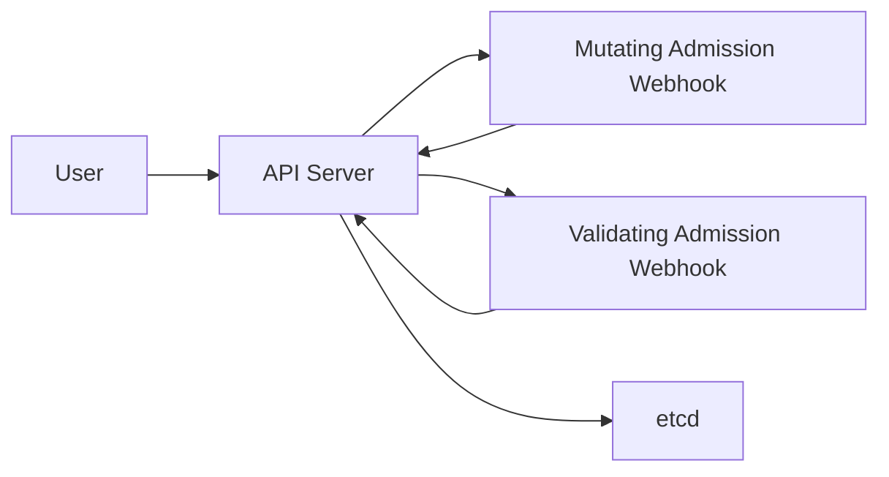

## 7.2. Pod Affinity & Anti-Affinity

Pod affinity adalah aturan penjadwalan yang mempertimbangkan lokasi Pod lain. Digunakan untuk:

* Mengelompokkan Pod agar berdekatan (affinity)
* Memisahkan Pod agar tersebar (anti-affinity)

### 7.2.1. Pod Affinity

Menempatkan Pod di node atau zona yang sama dengan Pod lain.

```yaml
affinity:
  podAffinity:
    requiredDuringSchedulingIgnoredDuringExecution:
    - labelSelector:
        matchLabels:
          app: backend
      topologyKey: kubernetes.io/hostname
```

### 7.2.2. Pod Anti-Affinity

Mencegah Pod berada berdekatan. Cocok untuk high availability.

```yaml
affinity:
  podAntiAffinity:
    preferredDuringSchedulingIgnoredDuringExecution:
    - weight: 50
      podAffinityTerm:
        labelSelector:
          matchLabels:
            app: api
        topologyKey: topology.kubernetes.io/zone
```

---

## 7.3. Taints & Tolerations

Taints dan tolerations memungkinkan node menolak Pod tertentu kecuali Pod tersebut memiliki toleration yang sesuai.

### 7.3.1. Taints

Taint ditempel pada node:

```bash
kubectl taint nodes node1 key=value:NoSchedule
```

Arti:

* Node hanya menerima Pod yang memiliki toleration yang cocok

Tipe efek taint:

| Efek             | Arti                                          |
| ---------------- | --------------------------------------------- |
| NoSchedule       | Tidak menjadwalkan Pod baru                   |
| PreferNoSchedule | Usahakan tidak menjadwalkan, tapi masih boleh |
| NoExecute        | Pod tanpa toleration akan dikeluarkan         |

### 7.3.2. Tolerations

Toleration ditambahkan pada Pod:

```yaml
tolerations:
- key: "key"
  operator: "Equal"
  value: "value"
  effect: "NoSchedule"
```

### 7.3.3. Contoh Kasus

Node GPU hanya boleh digunakan Pod ML:

```bash
kubectl taint nodes gpu-node accelerator=nvidia:NoSchedule
```

Pod ML:

```yaml
tolerations:
- key: "accelerator"
  operator: "Equal"
  value: "nvidia"
  effect: "NoSchedule"
```

---

## 7.4. Resource Quotas & LimitRange

Kubernetes menyediakan mekanisme pembatasan resource pada level namespace untuk fairness dan mencegah konsumsi berlebihan.

### 7.4.1. ResourceQuota

ResourceQuota membatasi total resource dalam satu namespace.

```yaml
apiVersion: v1
kind: ResourceQuota
metadata:
  name: team-a-quota
spec:
  hard:
    requests.cpu: "4"
    requests.memory: 8Gi
    limits.cpu: "8"
    limits.memory: 16Gi
    pods: "20"
```

Dapat membatasi:

* jumlah Pod
* total CPU dan memory
* jumlah PVC
* jumlah Service dan LoadBalancer

### 7.4.2. LimitRange

LimitRange memberikan default request, default limit, dan batas min atau max per container.

```yaml
apiVersion: v1
kind: LimitRange
metadata:
  name: default-limits
spec:
  limits:
  - type: Container
    default:
      cpu: "500m"
      memory: "512Mi"
    defaultRequest:
      cpu: "200m"
      memory: "256Mi"
    max:
      cpu: "2"
      memory: "2Gi"
    min:
      cpu: "100m"
      memory: "128Mi"
```

### Interaksi ResourceQuota dan LimitRange

* ResourceQuota mengatur jumlah maksimal resource dalam namespace
* LimitRange mengatur batas dan default untuk setiap Pod atau container

---

## 7.5. Pod Security Standards (PSS)

PSS adalah standar keamanan Pod modern yang menggantikan PodSecurityPolicy. PSS memiliki tiga level keamanan:

| Level      | Deskripsi                                                       |
| ---------- | --------------------------------------------------------------- |
| Privileged | Mengizinkan akses penuh, digunakan untuk Pod sistem             |
| Baseline   | Pengaturan aman default, mencegah privilege escalation          |
| Restricted | Tingkat keamanan tertinggi, menuntut non-root dan batasan ketat |

### 7.5.1. Privileged

* Akses paling bebas
* Mengizinkan privileged container dan host namespaces

### 7.5.2. Baseline

* Cocok untuk aplikasi umum
* Menolak fitur berisiko seperti privileged dan hostPID

### 7.5.3. Restricted

* Hanya mengizinkan non-root container
* Membutuhkan seccomp profile dan readOnlyRootFilesystem

### 7.5.4. Contoh PSS pada Namespace

```yaml
apiVersion: v1
kind: Namespace
metadata:
  name: secure-ns
  labels:
    pod-security.kubernetes.io/enforce: restricted
```

---

## 7.6. Admission Controller

Admission Controller adalah komponen yang memvalidasi dan memodifikasi request sebelum objek disimpan ke etcd. Ia berada setelah autentikasi dan otorisasi.

### 7.6.1. Dua Jenis Admission Controller

**Mutating Admission Controller**

  * Mengubah object sebelum disimpan
  * Contoh: menyuntikkan sidecar (Istio), menetapkan default value

**Validating Admission Controller**

  * Memvalidasi tanpa mengubah
  * Contoh: ResourceQuota, PodSecurity, built-in validation

### 7.6.2. Contoh Admission Controller Penting

| Admission Controller           | Fungsi                             |
| ------------------------------ | ---------------------------------- |
| PodSecurity                    | Menerapkan PSS                     |
| LimitRanger                    | Memberikan default resource        |
| ResourceQuota                  | Membatasi total resource namespace |
| MutatingWebhookConfiguration   | Mutasi custom                      |
| ValidatingWebhookConfiguration | Validasi custom                    |

### 7.6.3. Alur Kerja Admission

Alur umum:



1. User mengirim request ke API Server
2. API Server melakukan:

   * autentikasi
   * otorisasi
   * admission controller

3. Jika valid dari sisi API Server, object disimpan ke etcd

---

# Akhir Modul 7

Modul ini menjelaskan mekanisme penjadwalan Pod menggunakan affinity, anti-affinity, taints, dan tolerations. Selain itu, modul membahas pembatasan resource dengan ResourceQuota dan LimitRange, standar keamanan Pod Security Standards, dan Admission Controller sebagai lapisan validasi dan mutasi request.